#  Mini-Projet Docker : Student List

##  Objectif
Ce projet consiste à dockeriser une application Python Flask (backend) et PHP (frontend) avec Docker.

##  Structure du projet
mini-projet-docker/
│── student_list
│   │simple_api/
│       ├── student_age.py
│       ├── student_age.json
│       ├── requirements.txt
│       ├── Dockerfile
│
│── website/
│   ├── index.php
│ 
│
│── docker-compose.yml
│── docker-compose-registry.yml
│── README.md

## Installation et Exécution
###  Cloner le repository

git clone https://github.com/Salma-Chennoufi/mini-projet-docker.git

I. Construire (build) et tester l'API

###  Dockerfile 

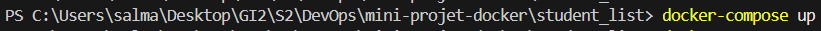

**Utilise l'image officielle de Python 3.8 basée sur Debian Buster**. Cela garantit que nous avons un environnement Python fonctionnel avec les outils nécessaires.

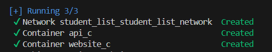

 **Ajoute des métadonnées sur l’auteur de l’image Docker**. Cela permet de savoir qui a construit cette image.

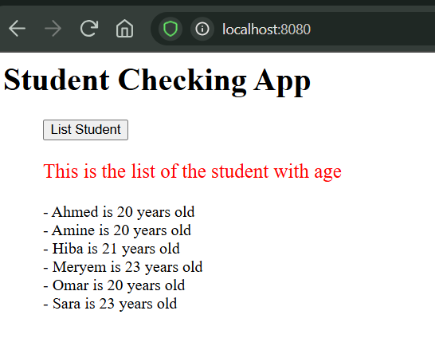

**Copie le fichier `requirements.txt` dans le conteneur**. Cela permet d’installer les dépendances Python.

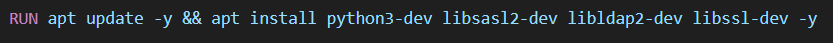

**Met à jour le système et installe des bibliothèques nécessaires** pour que certaines dépendances Python puissent être compilées correctement.

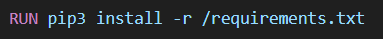

**Installe les dépendances Python définies dans `requirements.txt`**.

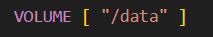

**Déclare `/data` comme un volume Docker** pour stocker les données de manière persistante, comme le fichier `student_age.json`.

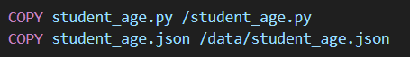

**Copie le fichier `student_age.py` (le code source de l’API) et `student_age.json` (les données des étudiants) dans le conteneur**.

**Indique que le conteneur utilisera le port 5000**, afin que l’API soit accessible depuis l’extérieur.

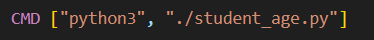

**Définit la commande par défaut à exécuter au démarrage du conteneur**. 

### Test

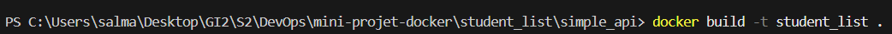

**Créer une image Docker** nommée student_list en utilisant le Dockerfile situé dans le répertoire courant (.).

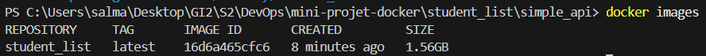

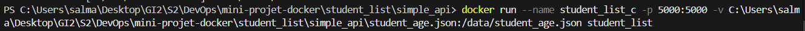

 **Créer et exécuter un conteneur Docker** nommé student_list_c, lier le port 5000 de l'hôte au port 5000 du conteneur pour accéder à l'API, et monter le fichier student_age.json de l'hôte dans /data/student_age.json du conteneur pour conserver les données, en utilisant l'image student_list.

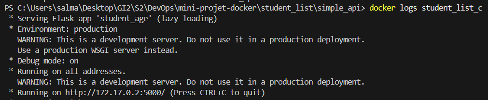

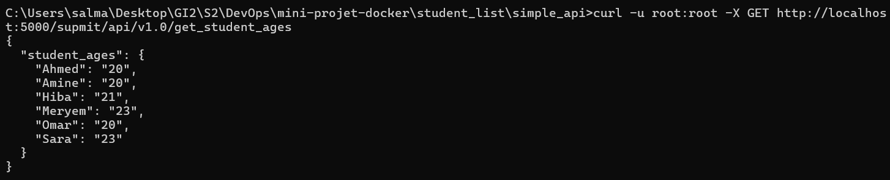

**Envoyer une requête GET** à l'API en utilisant l'authentification root:root pour récupérer la liste des âges des étudiants.
**L'API répond correctement**

